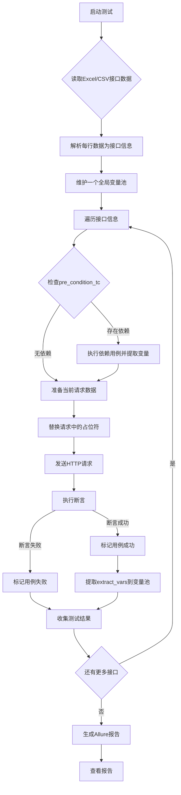

<div style="font-family: 'Kanit', sans-serif;text-align: center;border: 10px solid #fff;box-shadow: 1px 1px 2px #e6e6e6;background: linear-gradient(to left top, #11998e, #38ef7d); padding: 50px 0;">
<div style="color: #fff;">
    <h3 style="font-size: 25px;font-weight: 600;letter-spacing: 1px;text-transform: uppercase;margin: 0;">
       Python API Automation Tes
    </h3>
    <span style="font-size: 16px;text-transform: capitalize;">
    	Python API自动化测试框架
    </span>
</div>
</div>

## 🎯 工具介绍

这是一个基于 Python + pytest + requests 的 API 自动化测试工具，**专门设计给非技术人员使用**。你只需要会编辑 YAML
配置文件就能轻松添加和管理 API 测试用例。

## 📁 项目结构

```
api_test_tool/
├── config/
│   ├── test_config.yaml      # 🎯 测试配置（你主要编辑这个文件）
│   └── env_config.yaml       # 🌍 环境配置
├── tests/                    # 📋 测试代码（无需修改）
├── utils/                    # 🛠️ 工具代码（无需修改）
├── reports/                  # 📊 测试报告
├── requirements.txt          # 📦 依赖包
└── run_tests.py             # 🚀 运行入口
```

## 🚀 快速开始

### 1. 安装依赖

```bash
pip install -r requirements.txt
```

### 2. 配置环境

编辑 `config/env_config.yaml` 文件：

```yaml
environments:
  dev:
    base_url: "https://your-api-dev.com"
    timeout: 30
    headers:
      Content-Type: "application/json"
      Authorization: "Bearer your_token"

# 选择当前使用的环境
current_env: "dev"
```

### 3. 添加测试用例

编辑 `config/test_config.yaml` 文件，添加你的 API 测试用例。

### 4. 运行测试

```bash
python run_tests.py
```

## 📝 如何添加新的测试用例

**重要：非技术人员只需要编辑 `config/test_config.yaml` 文件即可！**

### 基本格式

```yaml
test_cases:
  - name: "测试用例名称"
    description: "测试用例描述"
    method: "HTTP方法"
    endpoint: "/api/endpoint"
    # 其他配置...
```

### 完整示例

```yaml
test_cases:
  - name: "获取用户信息"
    description: "测试获取用户信息接口"
    method: "GET"                    # HTTP方法: GET, POST, PUT, DELETE, PATCH
    endpoint: "/api/users/{id}"      # API路径
    path_params:
      id: 123
    headers: # 自定义请求头（可选）
      Custom-Header: "test-value"
    params: # URL参数（可选）
      include_profile: true
    expected_status: 200             # 期望的HTTP状态码
    expected_response: # 期望的响应内容（可选）
      user_id: 123
      username: "testuser"
    response_extract:
      user_id: "$[0].id"             # 提取响应中的 user.id 字段
```

## 🧪 测试用例配置详解

### 必填字段

| 字段                | 说明     | 示例                             |
|-------------------|--------|--------------------------------|
| `name`            | 测试用例名称 | "获取用户信息"                       |
| `method`          | HTTP方法 | "GET", "POST", "PUT", "DELETE" |
| `endpoint`        | API路径  | "/api/users/123"               |
| `expected_status` | 期望状态码  | 200, 201, 404, 500             |

### 可选字段

| 字段                  | 说明        | 示例                          |
|---------------------|-----------|-----------------------------|
| `description`       | 测试描述      | "测试获取用户信息接口"                |
| `path_params`       | 路径参数      | `id: 123`                   |
| `headers`           | 自定义请求头    | `Custom-Header: "value"`    |
| `params`            | URL参数     | `page: 1`                   |
| `body`              | 请求体（JSON） | `{"name": "test"}`          |
| `expected_response` | 期望响应内容    | `{"status": "success"}`     |
| `response_contains` | 响应必须包含的文本 | `["success", "user"]`       |
| `response_schema`   | 响应格式验证    | JSON Schema                 |
| `response_extract`  | 响应字段提取    | `user_id: "$.data.user.id"` |

## 📋 常见测试用例模板

### 1. GET 请求 - 获取数据

```yaml
- name: "获取用户列表"
  description: "获取所有用户列表"
  method: "GET"
  endpoint: "/api/users"
  params:
    page: 1
    limit: 10
  expected_status: 200
  response_contains:
    - "users"
    - "total"
```

### 2. POST 请求 - 创建数据

```yaml
- name: "创建新用户"
  description: "创建一个新用户"
  method: "POST"
  endpoint: "/api/users"
  body:
    username: "newuser"
    email: "test@example.com"
    password: "password123"
  expected_status: 201
  expected_response:
    message: "User created successfully"
```

### 3. PUT 请求 - 更新数据

```yaml
- name: "更新用户信息"
  description: "更新用户的基本信息"
  method: "PUT"
  endpoint: "/api/users/{id}"
  path_params:
    id: 123
  body:
    username: "updateduser"
    email: "updated@example.com"
  expected_status: 200
  response_contains:
    - "updated successfully"
```

### 4. DELETE 请求 - 删除数据

```yaml
- name: "删除用户"
  description: "删除指定用户"
  method: "DELETE"
  endpoint: "/api/users/123"
  expected_status: 204
  expected_response: null
```

### 5. 带认证的请求

```yaml
- name: "获取用户私有信息"
  description: "需要认证的接口"
  method: "GET"
  endpoint: "/api/users/profile"
  headers:
    Authorization: "Bearer your_specific_token"
  expected_status: 200
```

## 🔍 响应验证方式

### 1. 状态码验证

```yaml
expected_status: 200  # 必须返回200状态码
```

### 2. 响应内容验证

```yaml
expected_response:
  user_id: 123
  username: "testuser"
  email: "test@example.com"
```

### 3. 响应包含验证

```yaml
response_contains:
  - "success"
  - "user created"
  - "123"
```

### 4. 响应格式验证（JSON Schema）

```yaml
response_schema:
  type: "object"
  properties:
    user_id:
      type: "integer"
    username:
      type: "string"
    email:
      type: "string"
  required: [ "user_id", "username" ]
```

## 📂 响应提取

在测试用例中，你可以提取响应中的特定字段，以便在后续测试中使用：

### 1. 提取嵌套字段

```yaml
response_extract:
  user_id: "data.user.id"  # 提取响应中的 user.id 字段
  username: "data.user.name"  # 提取响应中的 user.name 字段
```

### 2. 提取顶层字段

```yaml
response_extract:
  user_id: "userId"  # 提取响应中的 user.id 字段
```

### 3. JSONPath 提取

```yaml
response_extract:
  user_id: "$[0].id"  # 提取响应中的 user.id 字段
```

## 🌍 环境管理

在 `config/env_config.yaml` 中配置不同环境：

```yaml
environments:
  dev:
    base_url: "https://api-dev.example.com"
    headers:
      Authorization: "Bearer dev_token"

  test:
    base_url: "https://api-test.example.com"
    headers:
      Authorization: "Bearer test_token"

  prod:
    base_url: "https://api.example.com"
    headers:
      Authorization: "Bearer prod_token"

# 切换环境只需修改这里
current_env: "dev"
```

## 📊 查看测试报告

运行测试后，会在 `reports/` 目录生成 HTML 格式的测试报告：

```
reports/
└── test_report_20241207_143052.html
```

用浏览器打开报告文件即可查看详细的测试结果。

## ❓ 常见问题

### Q: 如何添加新的 API 测试？

A: 只需在 `config/test_config.yaml` 文件的 `test_cases` 列表中添加新的测试用例即可。

### Q: 如何修改测试环境？

A: 修改 `config/env_config.yaml` 文件中的 `current_env` 字段。

### Q: 测试失败了怎么办？

A: 查看命令行输出和生成的 HTML 报告，找到失败的具体原因。

### Q: 如何测试需要登录的接口？

A: 在环境配置中添加 Authorization 头，或在具体测试用例中添加 headers 字段。

### Q: 可以测试哪些HTTP方法？

A: 支持 GET, POST, PUT, DELETE, PATCH 等常见HTTP方法。

## 🎉 总结

这个工具的设计理念是：

- **简单易用**：非技术人员只需编辑 YAML 配置文件
- **功能完整**：支持各种HTTP方法和响应验证
- **报告清晰**：生成易读的HTML测试报告
- **环境隔离**：支持多环境配置

你只需要：

1. 了解你要测试的API接口
2. 按照模板填写测试用例
3. 运行测试并查看报告

无需编写任何代码！

## 测试excel字段说明

| 列名               | 类型      | 描述                                            | 示例                                                                                           |
|------------------|---------|-----------------------------------------------|----------------------------------------------------------------------------------------------|
| test_case_id     | 字符串     | 测试用例唯一ID，例如 TC_001                            | TC_001                                                                                       |
| module           | 字符串     | 接口所属模块，用于测试报告分类                               | 用户管理                                                                                         |
| name             | 字符串     | 测试用例名称/描述                                     | 注册用户成功                                                                                       |
| priority         | 字符串     | 用例优先级（P0/P1/P2），Allure报告可显示                   | P0                                                                                           |
| method           | 字符串     | 请求方法 (GET/POST/PUT/DELETE)                    | POST                                                                                         |
| path             | 字符串     | 接口路径 (不包含baseURL)                             | /api/v1/users                                                                                |
| headers          | JSON字符串 | 请求头 (例如：{"Content-Type": "application/json"}) | {"Content-Type": "application/json", "Authorization": "$token$"} (使用 $variable$ 占位符)         |
| params           | JSON字符串 | Query参数 (GET请求)                               | {"id": "123", "type": "A"}                                                                   |
| body             | JSON字符串 | 请求体 (POST/PUT请求)                              | {"username": "testuser", "password": "password"}                                             |
| extract_vars     | JSON字符串 | 从响应中提取变量的规则                                   | {"token": "$.data.token", "user_id": "$.data.user_id"} (使用 JSONPath)                         |
| asserts          | JSON字符串 | 断言规则                                          | [{"type": "status_code", "value": 200}, {"type": "json_path", "expr": "$.code", "value": 0}] |
| pre_condition_tc | 字符串     | 前置依赖测试用例ID（如果当前用例依赖于其他用例的执行结果）                | TC_001 (表示当前用例执行前需要先执行 TC_001 并获取其提取的变量)                                                     |
| is_run           | 布尔值     | 是否执行该测试用例 (TRUE/FALSE)                        | TRUE                                                                                         |
| description      | 字符串     | 详细描述，用于 Allure 报告                             | 测试用户注册功能，验证成功状态码和返回的用户ID                                                                     |

## 整体流程

