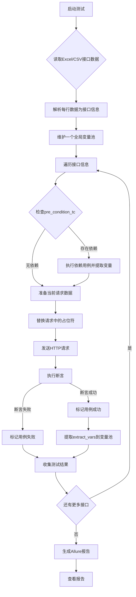
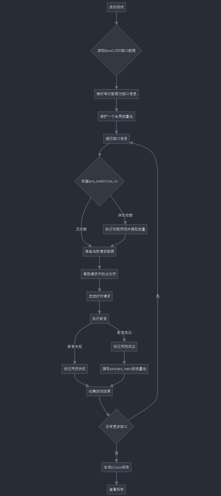

# Python API 自动化测试框架

一个功能强大、易于使用的API自动化测试框架，基于Python、Excel和Pytest，支持并行执行、灵活的断言、变量提取和依赖管理。

## 🎯 工具介绍

这是一个基于 Python + pytest + requests + Excel 的 API 自动化测试工具，专为测试人员设计，具有以下特点：

- **数据驱动**：使用Excel文件管理测试用例，无需编写代码即可创建新的测试
- **并行执行**：支持多线程并行执行测试用例，提高测试效率
- **智能依赖管理**：自动处理测试用例之间的依赖关系，确保正确的执行顺序
- **变量提取与重用**：从响应中提取变量并在后续请求中使用
- **灵活的断言**：支持多种断言类型，包括状态码、JSON路径、响应时间等
- **详细的报告**：集成Allure报告，提供直观的测试结果展示
- **重试机制**：自动重试失败的请求，提高测试稳定性
- **日志增强**：结构化日志，支持异步写入和日志轮转

## 📁 项目结构

```
ApiAutomationTest/
├── common/                  # 通用组件
│   ├── excel/              # Excel处理相关
│   │   └── excel_parser.py # Excel解析器
│   ├── http/               # HTTP请求相关
│   │   ├── http_client.py  # HTTP客户端
│   │   └── request_util.py # 请求工具
│   ├── log/                # 日志相关
│   │   └── logger.py       # 日志工具
│   └── validators/         # 验证器相关
│       └── assert_util.py  # 断言工具
├── config/                 # 配置目录
│   └── config.ini          # 配置文件
├── core/                   # 核心功能
│   └── patterns/           # 设计模式
│       └── singleton.py    # 单例模式
├── data/                   # 测试数据
│   └── test_cases.xlsx     # 测试用例Excel文件
├── reports/                # 测试报告
│   ├── allure-results/     # Allure报告结果
│   └── allure-report/      # Allure HTML报告
├── utils/                  # 工具类
│   └── test_case_generator.py # 测试用例生成工具
├── run_tests.py            # 测试执行入口
├── test_runner.py          # 测试运行器
├── pytest.ini              # Pytest配置
└── requirements.txt        # 项目依赖
```

## 🚀 快速开始

### 1. 安装依赖

```bash
pip install -r requirements.txt
```

### 2. 安装Allure（可选，用于生成报告）

- Windows: 使用Scoop或Chocolatey安装
  ```bash
  scoop install allure
  # 或
  choco install allure
  ```

- Mac: 使用Homebrew安装
  ```bash
  brew install allure
  ```

- Linux: 使用包管理器安装
  ```bash
  sudo apt-add-repository ppa:qameta/allure
  sudo apt-get update
  sudo apt-get install allure
  ```

### 3. 配置环境

编辑 `config/config.ini` 文件：

```ini
[API]
base_url = https://jsonplaceholder.typicode.com
timeout = 30
max_retries = 3
retry_delay = 1

[LOG]
level = INFO
rotation = 20 MB
retention = 10
compression = zip

[TEST]
excel_file = data/test_cases.xlsx
parallel_execution = false
max_workers = 4

[REPORT]
allure_results_dir = ./reports/allure-results
allure_report_dir = ./reports/allure-report
```

### 4. 添加测试用例

编辑 `data/test_cases.xlsx` 文件，按照模板添加你的 API 测试用例。

### 5. 运行测试

```bash
# 运行所有测试
python run_tests.py

# 运行特定模块的测试
python run_tests.py -m users

# 并行执行测试
python run_tests.py -p -w 4

# 生成Allure报告
python run_tests.py --report
```

## 📝 如何添加新的测试用例

### 方法1：使用测试用例生成工具

```bash
# 创建单个测试用例
python utils/test_case_generator.py create -n "获取用户列表" -m "users" -p "/users" --method GET

# 生成完整的CRUD测试套件
python utils/test_case_generator.py crud -r users -b /api/v1/
```

### 方法2：手动编辑Excel文件

打开 `data/test_cases.xlsx` 文件，按照模板添加测试用例。每行代表一个测试用例，包含以下字段：

### 完整示例

| test_case_id | module | name   | description  | method | path               | headers                              | params      | body                                          | extract_vars            | asserts                                                                                                      | pre_condition_tc | priority | tags             | is_run |
|--------------|--------|--------|--------------|--------|--------------------|--------------------------------------|-------------|-----------------------------------------------|-------------------------|--------------------------------------------------------------------------------------------------------------|------------------|----------|------------------|--------|
| TC0001       | users  | 获取用户列表 | 测试获取所有用户的API | GET    | /users             | {"Content-Type": "application/json"} | {"page": 1} |                                               | {"user_id": "$.id"}     | [{"type": "status_code", "expected": 200}]                                                                   |                  | P1       | smoke,regression | TRUE   |
| TC0002       | users  | 创建用户   | 测试创建新用户      | POST   | /users             | {"Content-Type": "application/json"} |             | {"name": "John", "email": "john@example.com"} | {"new_user_id": "$.id"} | [{"type": "status_code", "expected": 201}, {"type": "jsonpath", "expression": "$.name", "expected": "John"}] |                  | P1       | regression       | TRUE   |
| TC0003       | users  | 获取特定用户 | 测试获取特定用户信息   | GET    | /users/{{user_id}} | {"Content-Type": "application/json"} |             |                                               |                         | [{"type": "status_code", "expected": 200}]                                                                   | TC0001           | P2       | regression       | TRUE   |

## 🧪 测试用例配置详解

测试用例通过Excel文件进行管理，每行代表一个测试用例，包含以下字段：

### 必填字段

| 字段           | 说明                | 示例                     |
|--------------|-------------------|------------------------|
| test_case_id | 测试用例唯一ID          | TC0001                 |
| module       | 模块名称              | users                  |
| name         | 测试用例名称            | 获取用户列表                 |
| method       | HTTP方法            | GET, POST, PUT, DELETE |
| path         | API路径（不含base_url） | /users                 |
| is_run       | 是否执行该测试用例         | TRUE                   |

### 可选字段

| 字段               | 说明             | 示例                                         |
|------------------|----------------|--------------------------------------------|
| description      | 测试用例详细描述       | 测试获取所有用户的API                               |
| headers          | 请求头（JSON格式）    | {"Content-Type": "application/json"}       |
| params           | 查询参数（JSON格式）   | {"page": 1}                                |
| body             | 请求体（JSON格式）    | {"name": "John"}                           |
| extract_vars     | 要提取的变量（JSON格式） | {"user_id": "$.id"}                        |
| asserts          | 断言规则（JSON数组）   | [{"type": "status_code", "expected": 200}] |
| pre_condition_tc | 前置条件测试用例ID     | TC0001                                     |
| priority         | 优先级            | P0, P1, P2                                 |
| tags             | 标签（逗号分隔）       | smoke,regression                           |

### 1. GET 请求 - 获取数据

| test_case_id | module | name   | description | method | path   | headers                              | params                   | body | extract_vars           | asserts                                                                                          | pre_condition_tc | is_run |
|--------------|--------|--------|-------------|--------|--------|--------------------------------------|--------------------------|------|------------------------|--------------------------------------------------------------------------------------------------|------------------|--------|
| TC0001       | users  | 获取用户列表 | 获取所有用户列表    | GET    | /users | {"Content-Type": "application/json"} | {"page": 1, "limit": 10} |      | {"user_id": "$[0].id"} | [{"type": "status_code", "expected": 200}, {"type": "contains", "expected": ["users", "total"]}] |                  | TRUE   |

### 2. POST 请求 - 创建数据

| test_case_id | module | name  | description | method | path   | headers                              | params | body                                                                            | extract_vars            | asserts                                                                                                                              | pre_condition_tc | is_run |
|--------------|--------|-------|-------------|--------|--------|--------------------------------------|--------|---------------------------------------------------------------------------------|-------------------------|--------------------------------------------------------------------------------------------------------------------------------------|------------------|--------|
| TC0002       | users  | 创建新用户 | 创建一个新用户     | POST   | /users | {"Content-Type": "application/json"} |        | {"username": "newuser", "email": "test@example.com", "password": "password123"} | {"new_user_id": "$.id"} | [{"type": "status_code", "expected": 201}, {"type": "jsonpath", "expression": "$.message", "expected": "User created successfully"}] |                  | TRUE   |

### 3. PUT 请求 - 更新数据

| test_case_id | module | name   | description | method | path               | headers                              | params | body                                                        | extract_vars | asserts                                                                                                | pre_condition_tc | is_run |
|--------------|--------|--------|-------------|--------|--------------------|--------------------------------------|--------|-------------------------------------------------------------|--------------|--------------------------------------------------------------------------------------------------------|------------------|--------|
| TC0003       | users  | 更新用户信息 | 更新用户的基本信息   | PUT    | /users/{{user_id}} | {"Content-Type": "application/json"} |        | {"username": "updateduser", "email": "updated@example.com"} |              | [{"type": "status_code", "expected": 200}, {"type": "contains", "expected": ["updated successfully"]}] | TC0001           | TRUE   |

### 4. DELETE 请求 - 删除数据

| test_case_id | module | name | description | method | path               | headers                              | params | body | extract_vars | asserts                                    | pre_condition_tc | is_run |
|--------------|--------|------|-------------|--------|--------------------|--------------------------------------|--------|------|--------------|--------------------------------------------|------------------|--------|
| TC0004       | users  | 删除用户 | 删除指定用户      | DELETE | /users/{{user_id}} | {"Content-Type": "application/json"} |        |      |              | [{"type": "status_code", "expected": 204}] | TC0001           | TRUE   |

### 5. 带认证的请求

| test_case_id | module | name     | description | method | path           | headers                                                                   | params | body | extract_vars | asserts                                    | pre_condition_tc | is_run |
|--------------|--------|----------|-------------|--------|----------------|---------------------------------------------------------------------------|--------|------|--------------|--------------------------------------------|------------------|--------|
| TC0005       | users  | 获取用户私有信息 | 需要认证的接口     | GET    | /users/profile | {"Content-Type": "application/json", "Authorization": "Bearer {{token}}"} |        |      |              | [{"type": "status_code", "expected": 200}] |                  | TRUE   |

## 🔍 响应验证方式

在Excel测试用例中，通过`asserts`字段配置断言规则，支持多种断言类型：

### 1. 状态码验证

```json
[
  {
    "type": "status_code",
    "expected": 200
  }
]
```

### 2. JSON路径验证

```json
[
  {
    "type": "jsonpath",
    "expression": "$.data.name",
    "expected": "John"
  }
]
```

### 3. 响应包含验证

```json
[
  {
    "type": "contains",
    "expected": [
      "success",
      "user created"
    ]
  }
]
```

### 4. 响应时间验证

```json
[
  {
    "type": "response_time",
    "expected": 1000,
    "comparison": "less_than"
  }
]
```

### 5. 组合断言

```json
[
  {
    "type": "status_code",
    "expected": 200
  },
  {
    "type": "jsonpath",
    "expression": "$.code",
    "expected": 0
  },
  {
    "type": "contains",
    "expected": [
      "success"
    ]
  },
  {
    "type": "response_time",
    "expected": 1000,
    "comparison": "less_than"
  }
]
```

## 📂 响应提取

在测试用例中，你可以通过`extract_vars`字段提取响应中的特定字段，以便在后续测试中使用：

### 1. 提取嵌套字段

```json
{
  "user_id": "$.data.user.id",
  "username": "$.data.user.name"
}
```

### 2. 提取顶层字段

```json
{
  "user_id": "$.userId"
}
```

### 3. JSONPath 提取

```json
{
  "user_id": "$[0].id"
}
```

## 🌍 环境管理

在 `config/config.ini` 中配置不同环境：

```ini
[DEFAULT]
timeout = 30
max_retries = 3
retry_delay = 1

[DEV]
base_url = https://api-dev.example.com
auth_token = dev_token

[TEST]
base_url = https://api-test.example.com
auth_token = test_token

[PROD]
base_url = https://api.example.com
auth_token = prod_token

# 当前环境配置
[ENV]
current = DEV
```

切换环境只需修改 `[ENV]` 部分的 `current` 值。

## 📊 查看测试报告

运行测试后，会在 `reports/` 目录生成 HTML 格式的测试报告：

```
reports/
└── test_report_20241207_143052.html
```

用浏览器打开报告文件即可查看详细的测试结果。

## ❓ 常见问题

### Q: 如何添加新的 API 测试？

A: 有两种方法：1) 使用 `utils/test_case_generator.py` 工具生成测试用例；2) 直接编辑 `data/test_cases.xlsx` 文件添加新行。

### Q: 如何修改测试环境？

A: 修改 `config/config.ini` 文件中的 `[ENV]` 部分的 `current` 值。

### Q: 测试失败了怎么办？

A: 查看命令行输出和生成的 Allure 报告，找到失败的具体原因。报告位于 `reports/allure-report` 目录。

### Q: 如何测试需要登录的接口？

A: 创建一个登录测试用例，使用 `extract_vars` 提取 token，然后在后续测试用例的 `pre_condition_tc` 字段中引用该测试用例 ID。

### Q: 如何并行执行测试？

A: 使用命令 `python run_tests.py -p -w 4` 启动并行执行，其中 `-w` 参数指定并行线程数。

### Q: 如何处理测试用例之间的依赖关系？

A: 在依赖测试用例的 `pre_condition_tc` 字段中填写前置测试用例的 ID，框架会自动处理执行顺序和变量传递。

### Q: 如何在测试用例中使用动态数据？

A: 可以使用变量占位符 `{{variable_name}}`，这些变量可以来自环境配置或前置测试用例的提取结果。

## 🎉 总结

这个工具的设计理念是：

- **简单易用**：非技术人员只需编辑 Excel 文件
- **功能完整**：支持各种HTTP方法和响应验证
- **报告清晰**：生成直观的 Allure 测试报告
- **环境隔离**：支持多环境配置
- **并行执行**：提高测试效率
- **智能依赖**：自动处理测试用例之间的依赖关系

你只需要：

1. 了解你要测试的API接口
2. 按照模板填写 Excel 测试用例
3. 运行测试并查看报告

无需编写任何代码！

## 测试excel字段说明

| 列名               | 类型      | 描述                                            | 示例                                                                                           |
|------------------|---------|-----------------------------------------------|----------------------------------------------------------------------------------------------|
| test_case_id     | 字符串     | 测试用例唯一ID，例如 TC_001                            | TC_001                                                                                       |
| module           | 字符串     | 接口所属模块，用于测试报告分类                               | 用户管理                                                                                         |
| name             | 字符串     | 测试用例名称/描述                                     | 注册用户成功                                                                                       |
| priority         | 字符串     | 用例优先级（P0/P1/P2），Allure报告可显示                   | P0                                                                                           |
| method           | 字符串     | 请求方法 (GET/POST/PUT/DELETE)                    | POST                                                                                         |
| path             | 字符串     | 接口路径 (不包含baseURL)                             | /api/v1/users                                                                                |
| headers          | JSON字符串 | 请求头 (例如：{"Content-Type": "application/json"}) | {"Content-Type": "application/json", "Authorization": "$token$"} (使用 $variable$ 占位符)         |
| params           | JSON字符串 | Query参数 (GET请求)                               | {"id": "123", "type": "A"}                                                                   |
| body             | JSON字符串 | 请求体 (POST/PUT请求)                              | {"username": "testuser", "password": "password"}                                             |
| extract_vars     | JSON字符串 | 从响应中提取变量的规则                                   | {"token": "$.data.token", "user_id": "$.data.user_id"} (使用 JSONPath)                         |
| asserts          | JSON字符串 | 断言规则                                          | [{"type": "status_code", "value": 200}, {"type": "json_path", "expr": "$.code", "value": 0}] |
| pre_condition_tc | 字符串     | 前置依赖测试用例ID（如果当前用例依赖于其他用例的执行结果）                | TC_001 (表示当前用例执行前需要先执行 TC_001 并获取其提取的变量)                                                     |
| is_run           | 布尔值     | 是否执行该测试用例 (TRUE/FALSE)                        | TRUE                                                                                         |
| description      | 字符串     | 详细描述，用于 Allure 报告                             | 测试用户注册功能，验证成功状态码和返回的用户ID                                                                     |

## 整体流程



