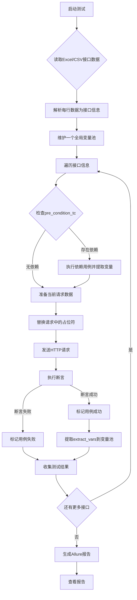

# 🚀 Python API 自动化测试框架

[](https://www.python.org/downloads/)
[](https://pytest.org/)
[](https://docs.qameta.io/allure/)
[](LICENSE)

一个功能强大、易于使用的API自动化测试框架，基于Python、Excel和Pytest，支持并行执行、智能依赖管理、变量提取和详细报告生成。

## ✨ 核心特性

### 🎯 **零代码测试**

- 📊 **Excel驱动**：使用Excel文件管理测试用例，测试人员无需编程基础
- 🔄 **智能依赖**：自动处理测试用例间的依赖关系和执行顺序
- 🔗 **变量传递**：支持从响应中提取变量并在后续请求中使用

### ⚡ **高性能执行**

- 🚀 **并行测试**：支持多线程并行执行，显著提升测试效率
- 🔄 **智能重试**：自动重试失败的请求，提高测试稳定性
- ⏱️ **超时控制**：灵活的超时配置，避免测试阻塞

### 🔍 **强大验证**

- ✅ **多种断言**：状态码、JSON路径、响应时间、内容包含等
- 📝 **JSONPath支持**：灵活的JSON数据提取和验证
- 🎯 **精确匹配**：支持精确值匹配和模糊匹配

### 📊 **专业报告**

- 📈 **Allure集成**：生成美观、详细的测试报告
- 📋 **结构化日志**：支持日志轮转和压缩
- 🎨 **可视化结果**：直观展示测试执行情况和趋势

### 🏗️ **优秀架构**

- 🧩 **模块化设计**：清晰的分层架构，职责分离
- 🔧 **高可扩展**：新功能可通过插件方式轻松添加
- 🔄 **易维护**：每个模块独立，便于测试和修改
- 📚 **易上手**：代码结构清晰，文档完善

## 📁 项目架构

```
ApiAutomationTest/
├── 📂 common/                     # 🔧 通用组件层
│   ├── 📂 excel/                  # Excel数据处理
│   │   ├── __init__.py
│   │   └── excel_parser.py        # Excel解析器
│   ├── 📂 http/                   # HTTP通信模块
│   │   ├── __init__.py
│   │   ├── http_client.py         # HTTP客户端封装
│   │   └── request_util.py        # 请求工具类
│   ├── 📂 log/                    # 日志系统
│   │   ├── __init__.py
│   │   └── logger.py              # 结构化日志工具
│   ├── 📂 patterns/               # 设计模式
│   │   ├── __init__.py
│   │   └── singleton.py           # 缓存单例模式
│   └── 📂 validators/             # 验证器
│       ├── __init__.py
│       └── assert_util.py         # 断言工具
├── 📂 config/                     # ⚙️ 配置文件
│   └── config.ini                 # 环境配置
├── 📂 core/                       # 🏗️ 核心业务层
│   ├── 📂 config/                 # 配置管理
│   │   ├── __init__.py
│   │   └── config_manager.py      # 配置管理器
│   ├── 📂 executor/               # 测试执行引擎
│   │   ├── __init__.py
│   │   └── test_executor.py       # 测试执行器
│   ├── 📂 manager/                # 用例管理
│   │   ├── __init__.py
│   │   └── test_case_manager.py   # 测试用例管理器
│   ├── 📂 patterns/               # 核心设计模式
│   │   └── __init__.py
│   ├── 📂 reporter/               # 报告生成
│   │   ├── __init__.py
│   │   └── allure_reporter.py     # Allure报告生成器
│   └── 📂 session/                # 会话管理
│       ├── __init__.py
│       └── test_session.py        # 测试会话管理
├── 📂 data/                       # 📊 测试数据
│   └── test_cases.xlsx            # 测试用例数据表
├── 📂 model/                      # 🏷️ 数据模型
│   ├── 📂 entity/                 # 实体类
│   │   ├── __init__.py
│   │   ├── api_schemas.py         # API数据模型
│   │   └── schemas.py             # 通用数据模型
│   └── 📂 enum/                   # 枚举类
│       ├── __init__.py
│       └── enums.py               # 枚举定义
├── 📂 reports/                    # 📈 测试报告
│   ├── allure-results/            # Allure原始数据
│   └── allure-report/             # Allure HTML报告
├── 📂 utils/                      # 🛠️ 工具集
│   ├── 📂 generator/              # 代码生成器
│   │   ├── __init__.py
│   │   └── test_case_generator.py # 测试用例生成工具
│   ├── 📂 id/                     # ID生成器
│   │   └── snow_id_utils.py       # 雪花ID工具
│   ├── 📂 internet/               # 网络工具
│   │   └── internet_utils.py      # 网络检测工具
│   └── 📂 time/                   # 时间工具
│       └── time_utils.py          # 时间处理工具
├── 📄 run_tests.py                # 🚀 测试执行入口
├── 📄 test_runner.py              # 🏃 测试运行器
├── 📄 pytest.ini                 # Pytest配置
├── 📄 requirements.txt            # 项目依赖
└── 📄 README.md                   # 项目文档
```

### 🏗️ 架构说明

| 层级      | 目录        | 职责       | 特点        |
|---------|-----------|----------|-----------|
| **通用层** | `common/` | 提供基础功能组件 | 可复用、无业务逻辑 |
| **核心层** | `core/`   | 实现核心业务逻辑 | 高内聚、低耦合   |
| **模型层** | `model/`  | 定义数据结构   | 类型安全、结构清晰 |
| **工具层** | `utils/`  | 提供辅助工具   | 独立功能、易扩展  |
| **数据层** | `data/`   | 存储测试数据   | 数据驱动、易维护  |
| **配置层** | `config/` | 管理环境配置   | 环境隔离、灵活切换 |

## 🚀 快速开始

### 📋 环境要求

- **Python**: 3.8+
- **操作系统**: Windows / macOS / Linux
- **内存**: 建议 4GB+
- **磁盘**: 至少 500MB 可用空间

### 1️⃣ 克隆项目

```bash
git clone <repository-url>
cd ApiAutomationTest
```

### 2️⃣ 安装依赖

```bash
# 创建虚拟环境（推荐）
python -m venv venv

# 激活虚拟环境
# Windows
venv\Scripts\activate
# macOS/Linux
source venv/bin/activate

# 安装依赖
pip install -r requirements.txt
```

### 3️⃣ 安装 Allure（可选）

> 💡 **提示**: Allure 用于生成美观的测试报告，强烈推荐安装

<details>
<summary>📱 <strong>Windows 安装</strong></summary>

```bash
# 使用 Scoop（推荐）
scoop install allure

# 或使用 Chocolatey
choco install allure

# 或手动下载
# 1. 访问 https://github.com/allure-framework/allure2/releases
# 2. 下载最新版本的 zip 文件
# 3. 解压并添加到 PATH 环境变量
```

</details>

<details>
<summary>🍎 <strong>macOS 安装</strong></summary>

```bash
# 使用 Homebrew
brew install allure

# 验证安装
allure --version
```

</details>

<details>
<summary>🐧 <strong>Linux 安装</strong></summary>

```bash
# Ubuntu/Debian
sudo apt-add-repository ppa:qameta/allure
sudo apt-get update
sudo apt-get install allure

# CentOS/RHEL
sudo yum install allure

# 验证安装
allure --version
```

</details>

### 4️⃣ 配置环境

编辑 `config/config.ini` 文件，配置你的测试环境：

```ini
[API]
base_url = https://jsonplaceholder.typicode.com  # 🌐 API基础URL
timeout = 30                                     # ⏱️ 请求超时时间(秒)
max_retries = 3                                  # 🔄 最大重试次数
retry_delay = 1                                  # ⏳ 重试间隔(秒)

[LOG]
level = INFO                                     # 📝 日志级别
rotation = 20 MB                                 # 📦 日志文件大小限制
retention = 10                                   # 🗂️ 保留日志文件数量
compression = zip                                # 🗜️ 日志压缩格式

[TEST]
excel_file = data/test_cases.xlsx               # 📊 测试用例文件路径
parallel_execution = false                       # ⚡ 是否并行执行
max_workers = 4                                  # 👥 最大并行线程数

[REPORT]
allure_results_dir = ./reports/allure-results   # 📈 Allure结果目录
allure_report_dir = ./reports/allure-report     # 📊 Allure报告目录
```

### 5️⃣ 准备测试数据

编辑 `data/test_cases.xlsx` 文件，添加你的 API 测试用例：

> 💡 **提示**: 可以使用提供的示例数据作为模板，或使用测试用例生成工具

### 6️⃣ 运行测试

```bash
# 🚀 运行所有测试
python run_tests.py

# 📂 运行特定模块的测试
python run_tests.py -m users

# ⚡ 并行执行测试（提升效率）
python run_tests.py -p -w 4

# 📊 生成并查看 Allure 报告
python run_tests.py --report
allure serve ./reports/allure-results

# 🏷️ 运行特定标签的测试
python run_tests.py -k "smoke"

# 🔍 详细输出模式
python run_tests.py -v
```

### 7️⃣ 查看结果

测试完成后，你可以通过以下方式查看结果：

- **控制台输出**: 实时查看测试执行状态
- **Allure报告**: 在浏览器中查看详细的可视化报告
- **日志文件**: 查看详细的执行日志（位于 `logs/` 目录）

> 🎉 **恭喜！** 你已经成功运行了第一个API自动化测试！

## 📝 测试用例管理

### 🛠️ 创建测试用例的两种方式

#### 方式一：使用代码生成工具 🚀

```bash
# 🔧 创建单个测试用例
python utils/test_case_generator.py create \
  -n "获取用户列表" \
  -m "users" \
  -p "/users" \
  --method GET

# 🏗️ 生成完整的CRUD测试套件
python utils/test_case_generator.py crud \
  -r users \
  -b /api/v1/

# 📋 批量生成测试用例
python utils/test_case_generator.py batch \
  --config batch_config.json
```

#### 方式二：手动编辑Excel文件 ✏️

打开 `data/test_cases.xlsx` 文件，按照模板添加测试用例。每行代表一个测试用例。

### 📊 Excel字段详解

#### 🔴 必填字段

| 字段             | 类型  | 说明          | 示例                             |
|----------------|-----|-------------|--------------------------------|
| `test_case_id` | 字符串 | 测试用例唯一标识符   | `TC_001`                       |
| `module`       | 字符串 | 功能模块名称      | `用户管理`                         |
| `name`         | 字符串 | 测试用例名称      | `获取用户列表`                       |
| `method`       | 字符串 | HTTP请求方法    | `GET`, `POST`, `PUT`, `DELETE` |
| `path`         | 字符串 | API路径（不含域名） | `/api/v1/users`                |
| `is_run`       | 布尔值 | 是否执行此用例     | `TRUE`, `FALSE`                |

#### 🟡 可选字段

| 字段                 | 类型     | 说明       | 示例                                           |
|--------------------|--------|----------|----------------------------------------------|
| `description`      | 字符串    | 详细描述     | `测试获取所有用户的API接口`                             |
| `priority`         | 字符串    | 优先级      | `P0`, `P1`, `P2`                             |
| `tags`             | 字符串    | 标签（逗号分隔） | `smoke,regression,api`                       |
| `headers`          | JSON   | 请求头      | `{"Content-Type": "application/json"}`       |
| `params`           | JSON   | 查询参数     | `{"page": 1, "size": 10}`                    |
| `body`             | JSON   | 请求体      | `{"name": "张三", "age": 25}`                  |
| `extract_vars`     | JSON   | 变量提取规则   | `{"user_id": "$.data.id"}`                   |
| `asserts`          | JSON数组 | 断言规则     | `[{"type": "status_code", "expected": 200}]` |
| `pre_condition_tc` | 字符串    | 前置依赖用例ID | `TC_001`                                     |

### 🎯 实战示例

#### 示例1：用户管理CRUD操作

| test_case_id | module | name | method | path              | body                                     | extract_vars              | asserts                                   | pre_condition_tc |
|--------------|--------|------|--------|-------------------|------------------------------------------|---------------------------|-------------------------------------------|------------------|
| `TC_001`     | 用户管理   | 创建用户 | POST   | /users            | `{"name":"张三","email":"zhang@test.com"}` | `{"user_id":"$.data.id"}` | `[{"type":"status_code","expected":201}]` |                  |
| `TC_002`     | 用户管理   | 查询用户 | GET    | /users/${user_id} |                                          |                           | `[{"type":"status_code","expected":200}]` | TC_001           |
| `TC_003`     | 用户管理   | 更新用户 | PUT    | /users/${user_id} | `{"name":"李四"}`                          |                           | `[{"type":"status_code","expected":200}]` | TC_001           |
| `TC_004`     | 用户管理   | 删除用户 | DELETE | /users/${user_id} |                                          |                           | `[{"type":"status_code","expected":204}]` | TC_001           |

## 🧪 测试用例配置详解

测试用例通过Excel文件进行管理，每行代表一个测试用例，包含以下字段：

### 必填字段

| 字段           | 说明                | 示例                     |
|--------------|-------------------|------------------------|
| test_case_id | 测试用例唯一ID          | TC0001                 |
| module       | 模块名称              | users                  |
| name         | 测试用例名称            | 获取用户列表                 |
| method       | HTTP方法            | GET, POST, PUT, DELETE |
| path         | API路径（不含base_url） | /users                 |
| is_run       | 是否执行该测试用例         | TRUE                   |

### 可选字段

| 字段               | 说明             | 示例                                         |
|------------------|----------------|--------------------------------------------|
| description      | 测试用例详细描述       | 测试获取所有用户的API                               |
| headers          | 请求头（JSON格式）    | {"Content-Type": "application/json"}       |
| params           | 查询参数（JSON格式）   | {"page": 1}                                |
| body             | 请求体（JSON格式）    | {"name": "John"}                           |
| extract_vars     | 要提取的变量（JSON格式） | {"user_id": "$.id"}                        |
| asserts          | 断言规则（JSON数组）   | [{"type": "status_code", "expected": 200}] |
| pre_condition_tc | 前置条件测试用例ID     | TC0001                                     |
| priority         | 优先级            | P0, P1, P2                                 |
| tags             | 标签（逗号分隔）       | smoke,regression                           |

### 1. GET 请求 - 获取数据

| test_case_id | module | name   | description | method | path   | headers                              | params                   | body | extract_vars           | asserts                                                                                          | pre_condition_tc | is_run |
|--------------|--------|--------|-------------|--------|--------|--------------------------------------|--------------------------|------|------------------------|--------------------------------------------------------------------------------------------------|------------------|--------|
| TC0001       | users  | 获取用户列表 | 获取所有用户列表    | GET    | /users | {"Content-Type": "application/json"} | {"page": 1, "limit": 10} |      | {"user_id": "$[0].id"} | [{"type": "status_code", "expected": 200}, {"type": "contains", "expected": ["users", "total"]}] |                  | TRUE   |

### 2. POST 请求 - 创建数据

| test_case_id | module | name  | description | method | path   | headers                              | params | body                                                                            | extract_vars            | asserts                                                                                                                              | pre_condition_tc | is_run |
|--------------|--------|-------|-------------|--------|--------|--------------------------------------|--------|---------------------------------------------------------------------------------|-------------------------|--------------------------------------------------------------------------------------------------------------------------------------|------------------|--------|
| TC0002       | users  | 创建新用户 | 创建一个新用户     | POST   | /users | {"Content-Type": "application/json"} |        | {"username": "newuser", "email": "test@example.com", "password": "password123"} | {"new_user_id": "$.id"} | [{"type": "status_code", "expected": 201}, {"type": "jsonpath", "expression": "$.message", "expected": "User created successfully"}] |                  | TRUE   |

### 3. PUT 请求 - 更新数据

| test_case_id | module | name   | description | method | path              | headers                              | params | body                                                        | extract_vars | asserts                                                                                                | pre_condition_tc | is_run |
|--------------|--------|--------|-------------|--------|-------------------|--------------------------------------|--------|-------------------------------------------------------------|--------------|--------------------------------------------------------------------------------------------------------|------------------|--------|
| TC0003       | users  | 更新用户信息 | 更新用户的基本信息   | PUT    | /users/${user_id} | {"Content-Type": "application/json"} |        | {"username": "updateduser", "email": "updated@example.com"} |              | [{"type": "status_code", "expected": 200}, {"type": "contains", "expected": ["updated successfully"]}] | TC0001           | TRUE   |

### 4. DELETE 请求 - 删除数据

| test_case_id | module | name | description | method | path              | headers                              | params | body | extract_vars | asserts                                    | pre_condition_tc | is_run |
|--------------|--------|------|-------------|--------|-------------------|--------------------------------------|--------|------|--------------|--------------------------------------------|------------------|--------|
| TC0004       | users  | 删除用户 | 删除指定用户      | DELETE | /users/${user_id} | {"Content-Type": "application/json"} |        |      |              | [{"type": "status_code", "expected": 204}] | TC0001           | TRUE   |

### 5. 带认证的请求

| test_case_id | module | name     | description | method | path           | headers                                                                   | params | body | extract_vars | asserts                                    | pre_condition_tc | is_run |
|--------------|--------|----------|-------------|--------|----------------|---------------------------------------------------------------------------|--------|------|--------------|--------------------------------------------|------------------|--------|
| TC0005       | users  | 获取用户私有信息 | 需要认证的接口     | GET    | /users/profile | {"Content-Type": "application/json", "Authorization": "Bearer {{token}}"} |        |      |              | [{"type": "status_code", "expected": 200}] |                  | TRUE   |

## 🔍 响应验证方式

在Excel测试用例中，通过`asserts`字段配置断言规则，支持多种断言类型：

### 1. 状态码验证

```json
[
  {
    "type": "status_code",
    "expected": 200
  }
]
```

### 2. JSON路径验证

```json
[
  {
    "type": "jsonpath",
    "expression": "$.data.name",
    "expected": "John"
  }
]
```

### 3. 响应包含验证

```json
[
  {
    "type": "contains",
    "expected": [
      "success",
      "user created"
    ]
  }
]
```

### 4. 响应时间验证

```json
[
  {
    "type": "response_time",
    "expected": 1000,
    "comparison": "less_than"
  }
]
```

### 5. 组合断言

```json
[
  {
    "type": "status_code",
    "expected": 200
  },
  {
    "type": "jsonpath",
    "expression": "$.code",
    "expected": 0
  },
  {
    "type": "contains",
    "expected": [
      "success"
    ]
  },
  {
    "type": "response_time",
    "expected": 1000,
    "comparison": "less_than"
  }
]
```

## 📂 响应提取

在测试用例中，你可以通过`extract_vars`字段提取响应中的特定字段，以便在后续测试中使用：

### 1. 提取嵌套字段

```json
{
  "user_id": "$.data.user.id",
  "username": "$.data.user.name"
}
```

### 2. 提取顶层字段

```json
{
  "user_id": "$.userId"
}
```

### 3. JSONPath 提取

```json
{
  "user_id": "$[0].id"
}
```

## 🔧 变量占位符

框架支持在请求的各个部分使用变量占位符，实现动态数据替换：

### 占位符语法

使用 `${variable_name}` 格式在以下位置定义占位符：

- **请求头（Headers）**
- **请求路径（URL Path）**
- **请求参数（Query Parameters）**
- **请求体（Request Body）**

### 使用示例

#### 1. 请求头中的占位符

```json
{
  "Authorization": "Bearer ${auth_token}",
  "User-Agent": "TestClient/${version}"
}
```

#### 2. 请求路径中的占位符

```
/api/users/${user_id}/profile
/api/orders/${order_id}/items
```

#### 3. 请求参数中的占位符

```json
{
  "page": "${page_num}",
  "size": "${page_size}",
  "filter": "status=${status}"
}
```

#### 4. 请求体中的占位符

```json
{
  "name": "${user_name}",
  "email": "${user_email}",
  "age": ${user_age},
  "department_id": ${dept_id}
}
```

### 变量来源

占位符的值可以来自以下来源：

1. **环境配置**：在 `config.ini` 中定义的变量
2. **前置测试用例**：通过 `extract_vars` 提取的响应数据
3. **全局变量**：框架预定义的系统变量

### 实际应用场景

```excel
| url | headers | body |
|-----|---------|------|
| /api/users/${user_id} | {"Authorization": "Bearer ${token}"} | {"name": "${new_name}"} |
```

当执行测试时，框架会自动将占位符替换为实际值，实现动态测试数据的灵活运用。

## 🌍 环境管理

在 `config/config.ini` 中配置不同环境：

```ini
[DEFAULT]
timeout = 30
max_retries = 3
retry_delay = 1

[DEV]
base_url = https://api-dev.example.com
auth_token = dev_token

[TEST]
base_url = https://api-test.example.com
auth_token = test_token

[PROD]
base_url = https://api.example.com
auth_token = prod_token

# 当前环境配置
[ENV]
current = DEV
```

切换环境只需修改 `[ENV]` 部分的 `current` 值。

## 📊 查看测试报告

运行测试后，会在 `reports/` 目录生成 HTML 格式的测试报告：

```
reports/
└── test_report_20241207_143052.html
```

用浏览器打开报告文件即可查看详细的测试结果。

## ❓ 常见问题

### Q: 如何添加新的 API 测试？

A: 有两种方法：1) 使用 `utils/test_case_generator.py` 工具生成测试用例；2) 直接编辑 `data/test_cases.xlsx` 文件添加新行。

### Q: 如何修改测试环境？

A: 修改 `config/config.ini` 文件中的 `[ENV]` 部分的 `current` 值。

### Q: 测试失败了怎么办？

A: 查看命令行输出和生成的 Allure 报告，找到失败的具体原因。报告位于 `reports/allure-report` 目录。

### Q: 如何测试需要登录的接口？

A: 创建一个登录测试用例，使用 `extract_vars` 提取 token，然后在后续测试用例的 `pre_condition_tc` 字段中引用该测试用例 ID。

### Q: 如何并行执行测试？

A: 使用命令 `python run_tests.py -p -w 4` 启动并行执行，其中 `-w` 参数指定并行线程数。

### Q: 如何处理测试用例之间的依赖关系？

A: 在依赖测试用例的 `pre_condition_tc` 字段中填写前置测试用例的 ID，框架会自动处理执行顺序和变量传递。

### Q: 如何在测试用例中使用动态数据？

A: 可以使用变量占位符 `{{variable_name}}`，这些变量可以来自环境配置或前置测试用例的提取结果。

## 🚀 高级功能

### 🔄 智能重试机制

框架内置了智能重试装饰器，当测试失败时自动重试：

```python
@retry_on_failure(retries=3, delay=1)
def test_api():
    # 测试逻辑
    pass
```

### 🎯 多种断言类型

支持丰富的响应验证方式：

- **状态码断言**：验证HTTP状态码
- **JSONPath断言**：使用JSONPath表达式提取和验证数据
- **内容包含断言**：检查响应是否包含特定内容
- **响应时间断言**：验证API响应时间性能
- **数据类型断言**：验证响应数据的类型

### 📊 并行执行

支持多线程并行执行测试用例，提升测试效率：

```python
# 在test_executor.py中实现
with concurrent.futures.ThreadPoolExecutor(max_workers=workers) as executor:
    futures = [executor.submit(self.execute_test_case, test_case)
               for test_case in test_cases]
```

## 📋 最佳实践

### 1. 测试用例设计原则

- **单一职责**：每个测试用例只验证一个功能点
- **独立性**：测试用例之间应尽量独立，减少依赖
- **可重复性**：测试结果应该是可重复和稳定的
- **清晰命名**：使用描述性的测试用例名称

### 2. 数据管理策略

- **环境隔离**：不同环境使用不同的测试数据
- **数据清理**：测试后及时清理产生的测试数据
- **敏感数据**：避免在测试用例中硬编码敏感信息

### 3. 错误处理

- **优雅降级**：当依赖服务不可用时的处理策略
- **重试机制**：对于网络波动导致的失败进行重试
- **详细日志**：记录足够的信息用于问题排查

### 4. 持续集成

```yaml
# .github/workflows/api-test.yml
name: API Tests
on: [ push, pull_request ]
jobs:
  test:
    runs-on: ubuntu-latest
    steps:
      - uses: actions/checkout@v2
      - name: Setup Python
        uses: actions/setup-python@v2
        with:
          python-version: '3.9'
      - name: Install dependencies
        run: pip install -r requirements.txt
      - name: Run tests
        run: python run_tests.py
      - name: Generate report
        run: allure generate reports/allure-results -o reports/allure-report
```

## 🎉 总结

### 核心优势

- **零代码测试**：非技术人员也能轻松上手
- **企业级功能**：支持复杂的测试场景和需求
- **专业报告**：生成详细的测试报告和分析
- **高性能执行**：支持并行执行和性能优化
- **灵活扩展**：模块化设计，易于定制和扩展

### 适用场景

- ✅ RESTful API 接口测试
- ✅ 微服务架构测试
- ✅ 回归测试自动化
- ✅ 持续集成/持续部署
- ✅ 接口功能验证
- ✅ 接口依赖关系测试

### 快速开始

1. **准备环境**：安装Python和依赖包
2. **配置项目**：修改config.ini中的环境配置
3. **编写用例**：在Excel中定义测试用例
4. **执行测试**：运行测试并查看报告
5. **持续优化**：根据测试结果优化用例设计

> 💡 **提示**：建议从简单的GET请求开始，逐步添加复杂的测试场景。

## 📈 执行流程图




## 🤝 贡献指南

我们欢迎任何形式的贡献！如果你想为这个项目做出贡献，请遵循以下步骤：

### 🐛 报告问题

1. 在提交问题之前，请先搜索现有的问题
2. 使用问题模板提供详细信息
3. 包含重现步骤和预期行为

### 💡 功能建议

1. 描述你想要的功能
2. 解释为什么这个功能有用
3. 提供可能的实现方案

### 🔧 代码贡献

1. Fork 这个仓库
2. 创建你的功能分支 (`git checkout -b feature/AmazingFeature`)
3. 提交你的更改 (`git commit -m 'Add some AmazingFeature'`)
4. 推送到分支 (`git push origin feature/AmazingFeature`)
5. 打开一个 Pull Request

### 📝 代码规范

- 遵循 PEP 8 Python 代码风格
- 添加适当的注释和文档字符串
- 编写单元测试覆盖新功能
- 确保所有测试通过

## 📄 许可证

本项目采用 MIT 许可证 - 查看 [LICENSE](LICENSE) 文件了解详情。

## 🙏 致谢

感谢以下开源项目的支持：

- [Pytest](https://pytest.org/) - 强大的Python测试框架
- [Allure](https://docs.qameta.io/allure/) - 美观的测试报告工具
- [Requests](https://requests.readthedocs.io/) - 优雅的HTTP库
- [JSONPath](https://github.com/h2non/jsonpath-ng) - JSON数据提取工具
- [Openpyxl](https://openpyxl.readthedocs.io/) - Excel文件处理库

---

<div align="center">
  <p>如果这个项目对你有帮助，请给它一个 ⭐️</p>
  <p>Made with ❤️ by API Testing Team</p>
</div>